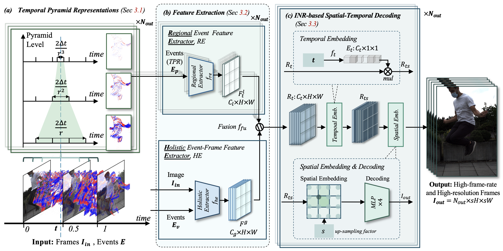

# Event-guided Continuous Space-Time Video Super-Resolution (C-STVSR)

This repository contains the implementation of our paper **"Event-guided Continuous Space-Time Video Super-Resolution (C-STVSR)"**, which introduces the first event-guided C-STVSR method. This method combines event-based temporal pyramid representation and implicit neural representation (INR) for high-performance video frame interpolation and super-resolution tasks.

## Key Contributions

The main contributions of this work are:

- **Event Temporal Pyramid Representation**: A method for capturing short-term dynamic motion in videos.
- **Feature Extraction Process**: Combines holistic and regional features to efficiently manage motion dependencies in video frames.
- **Spatiotemporal Decoding**: Utilizes INR to avoid traditional optical flow methods and ensures stable frame interpolation through temporal-spatial embedding.

## Method Overview



Our approach integrates event data with temporal pyramid representation, enabling seamless handling of both fast-moving and stationary objects. This method excels in real-world scenarios with complex motion patterns, outperforming previous approaches in terms of both temporal stability and spatial resolution.

## Datasets Used

We evaluate our method on several datasets, including:

- **Adobe240**: A simulated dataset used for frame interpolation and super-resolution tasks.
- **GoPro**: A high-quality dataset commonly used for video frame interpolation.
- **BS-ERGB**: A real-world event and frame dataset used for training and evaluation.
- **CED**: A real-world dataset used for video super-resolution tasks.

## Results

Our method achieves state-of-the-art performance in both video frame interpolation (VFI) and video super-resolution (VSR), surpassing previous methods in terms of both PSNR and SSIM, as well as visual quality.

## Visual Materials

For a better understanding of our method and its performance, we provide visualizations of the results on various datasets. The following figures demonstrate the capabilities of our approach:

- **Figure**: 

These visualizations illustrate how our method handles complex dynamic motion, reduces ghosting artifacts, and provides high-resolution video outputs.

## Video Supplementary Materials

For a better understanding of our method and its performance, we provide visualizations of the results on various datasets. The following videos demonstrate the capabilities of our approach:

[Videos - Onedirve](https://hkustgz-my.sharepoint.com/:f:/g/personal/ylu066_connect_hkust-gz_edu_cn/EoIjDFjpGkRDlCk4429Sc9EB_j1L43D_JdNuW2jEDjorEw)

### 1. **Adobe240 Dataset:**

The videos contain clips from the Adobe240 dataset, showcasing the capabilities of our method in various scenarios:

### 2. **TimeLens++ Dataset:**

**TimeLensPP-Ours-1**: This video shows the performance of our method on real-world datasets and includes visualizations of features. It demonstrates that our method effectively captures **local motion** in dynamic environments, showcasing its robustness compared to other methods.

### 3. **Comparative Results:**

**Our-vs-Timelens**: This video presents a direct comparison between our method and TimeLens. It highlights the advantages of our approach in terms of motion preservation, stability, and image quality.

These videos provide a comprehensive view of how our method handles various motion dynamics, including fast-moving objects, intricate textures, and camera movements. They also highlight the superior performance of our method in real-world scenarios, reducing ghosting artifacts and improving temporal stability.


## Citation

If you find this work useful, please cite our paper:

```
@article{lu2024hr,
  title={HR-INR: Continuous Space-Time Video Super-Resolution via Event Camera},
  author={Lu, Yunfan and Wang, Zipeng and Wang, Yusheng and Xiong, Hui},
  journal={arXiv preprint arXiv:2405.13389},
  year={2024}
}
```


## License

This project is licensed under the **Academic Use License**. You are free to use, modify, and distribute the code for academic, research, and non-commercial purposes. For commercial use, please contact the authors for a separate licensing agreement.